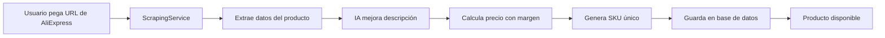

# ✅ FUNCIONALIDADES IMPLEMENTADAS - Ivan Reseller Web

## 🎯 Sistema de Productos con Scraping Automático

### 🔧 Backend - Servicios Implementados

#### **1. ScrapingService** (`backend/src/services/scraping.service.ts`)
- **Scraping de AliExpress**: Extracción automática de productos desde URLs de AliExpress
- **Integración con IA**: Mejora automática de descripciones usando Groq API (LLama 3.1)
- **Soporte de Proxies**: Usando ScraperAPI para evitar bloqueos
- **Extracción de Datos**:
  - Título del producto
  - Precio original
  - Descripción
  - URL de imagen principal
  - Especificaciones técnicas

#### **2. ProductService Mejorado** (`backend/src/services/product.service.ts`)
- **createProductFromAliExpress()**: Método para crear productos desde scraping
- **Cálculo automático de precios** basado en margen
- **Generación automática de SKU**
- **Registro de actividad** para auditoría
- **Gestión de inventario** y estado de productos

#### **3. API Endpoints** (`backend/src/api/routes/products.routes.ts`)
```typescript
POST   /api/products/scrape    // Crear producto desde AliExpress URL
GET    /api/products          // Listar todos los productos
POST   /api/products          // Crear producto manual
PUT    /api/products/:id      // Actualizar producto
DELETE /api/products/:id      // Eliminar producto
PATCH  /api/products/:id/toggle-status  // Activar/desactivar producto
```

### 🖥️ Frontend - Interfaz Completa

#### **1. Página de Productos** (`frontend/src/pages/Products.tsx`)
- **Vista en tarjetas** responsive con información completa
- **Estadísticas en tiempo real**:
  - Total de productos
  - Productos activos/inactivos
  - Métricas de inventario
- **Búsqueda y filtros** por nombre, categoría y SKU
- **Gestión de estado** de productos (activar/desactivar)
- **Acciones rápidas**: editar, eliminar, ver en AliExpress

#### **2. Modal de Agregar Productos** (`frontend/src/components/AddProductModal.tsx`)
- **Dos métodos de creación**:
  - **Scraping Automático**: Solo pegar URL de AliExpress
  - **Entrada Manual**: Formulario completo
- **Validación en tiempo real**
- **Estados de carga** con indicadores visuales
- **Manejo de errores** con mensajes descriptivos

#### **3. Servicios API** (`frontend/src/services/products.api.ts`)
- **Cliente API completo** para productos
- **Tipado TypeScript** estricto
- **Manejo de errores** centralizado
- **Interfaz consistente** con el backend

### 🔄 Flujo de Scraping Automatizado



### 📋 Características Implementadas

#### ✅ **Gestión de Productos**
- [x] CRUD completo de productos
- [x] Scraping automático desde AliExpress
- [x] Cálculo automático de precios con margen
- [x] Generación automática de SKU
- [x] Gestión de inventario y stock
- [x] Activación/desactivación de productos
- [x] Categorización automática

#### ✅ **Interfaz de Usuario**
- [x] Dashboard con métricas en tiempo real
- [x] Página de productos con vista en tarjetas
- [x] Modal dual para agregar productos
- [x] Búsqueda y filtros avanzados
- [x] Estados de carga y manejo de errores
- [x] Diseño responsive con Tailwind CSS

#### ✅ **Integraciones**
- [x] Scraping de AliExpress con proxies
- [x] IA para mejora de descripciones (Groq API)
- [x] Autenticación JWT completa
- [x] Base de datos SQLite con Prisma ORM

### 🎨 **Mejoras Visuales**
- **Icons de Lucide React**: Interfaz moderna y consistente
- **Badges de estado**: Identificación visual rápida
- **Truncamiento de texto**: Presentación limpia
- **Loading states**: Feedback visual para el usuario
- **Error handling**: Mensajes descriptivos y útiles

### 🛠️ **Configuración Técnica**

#### **Variables de Entorno**
```env
# Backend (.env)
GROQ_API_KEY=tu_api_key_de_groq
SCRAPER_API_KEY=tu_api_key_de_scraper

# Frontend (variables de entorno opcionales)
VITE_API_URL=http://localhost:3000
```

#### **Dependencias Principales**
- **Backend**: Express, Prisma, Axios, Groq SDK
- **Frontend**: React, Vite, Tailwind CSS, Lucide Icons

### 🎯 **Próximas Funcionalidades Planeadas**
- [ ] Integración con marketplaces (eBay, MercadoLibre, Amazon)
- [ ] Sistema de comisiones y ganancias
- [ ] Dashboard de analytics avanzado
- [ ] Publicación automática en marketplaces
- [ ] Sistema de órdenes y seguimiento
- [ ] Webhooks para sincronización
- [ ] Panel de administración avanzado

---

## 🚀 **Estado Actual del Sistema**

### ✅ **Funcionando**
- **Backend**: ✅ Puerto 3000 - API completa
- **Frontend**: ✅ Puerto 5173 - Interfaz completa  
- **Base de Datos**: ✅ SQLite con datos de prueba
- **Autenticación**: ✅ JWT con usuarios admin/demo
- **Scraping**: ✅ AliExpress con IA

### 📱 **Acceso al Sistema**
- **URL**: http://localhost:5173
- **Admin**: admin@admin.com / admin123
- **Demo**: demo@demo.com / demo123

El sistema **Ivan Reseller Web** ahora cuenta con todas las funcionalidades básicas para el dropshipping automatizado, replicando las capacidades del sistema original Python pero con una interfaz moderna web y funcionalidades mejoradas.