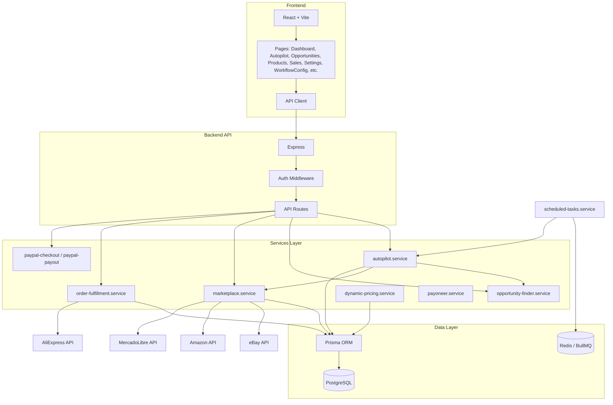
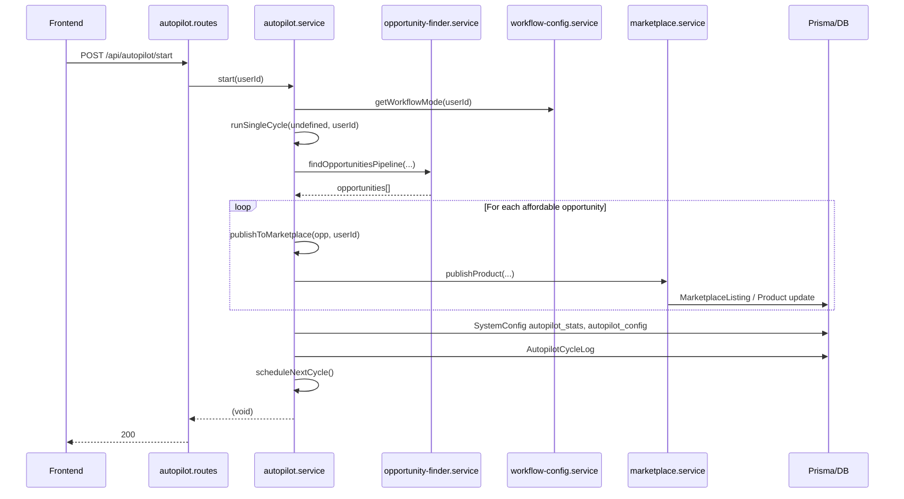
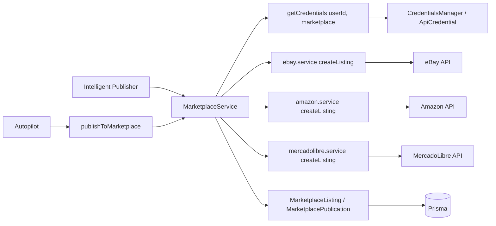
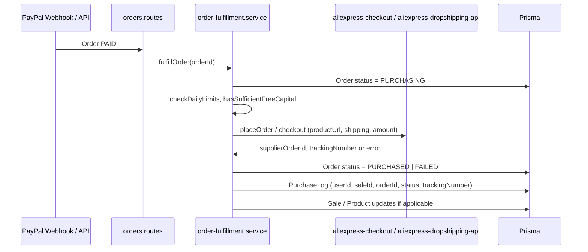

# System Architecture Analysis ? Ivan Reseller

**Purpose:** Describe how the Ivan Reseller dropshipping automation system works, which modules exist, and how they interact. This document is the outcome of a full repository audit.

---

## 1. High-Level Architecture

- **Frontend:** React + Vite; pages call backend via API client (e.g. axios).
- **Backend:** Express app; routes under `/api/*`; auth middleware for protected routes.
- **Services:** Core logic in `backend/src/services/` and `backend/src/modules/`; no direct DB in routes.
- **Data:** Prisma ? PostgreSQL; Redis used for BullMQ (scheduled tasks, queues).

---

## 2. Main API Surface (Mount Points)

Routes are mounted in `backend/src/app.ts`. Key prefixes:

| Prefix | Purpose |
|--------|---------|
| `/api/auth` | Login, register, tokens |
| `/api/users` | User CRUD |
| `/api/products` | Product catalog |
| `/api/sales` | Sales records |
| `/api/opportunities` | Opportunity discovery and list |
| `/api/autopilot` | Autopilot start/stop, config, workflows, stats, logs |
| `/api/marketplace` | Publish, sync inventory, marketplace ops |
| `/api/marketplace-oauth` | OAuth callbacks (eBay, Amazon, ML, AliExpress) |
| `/api/workflow` | Workflow config (stages, working capital) |
| `/api/orders` | Order CRUD, fulfillment triggers |
| `/api/paypal` | PayPal checkout, capture, payouts |
| `/api/system` | Diagnostics, full-diagnostics, (later business-diagnostics) |
| `/api/internal` | Internal tools (test-full-cycle, test-full-dropshipping-cycle, etc.) |
| `/api/trends` | Trend keywords for discovery |
| `/api/aliexpress` | AliExpress Affiliate / Dropshipping |
| `/api/dashboard` | Dashboard aggregates |
| `/api/profitability` | Profitability evaluation |

---

## 3. Autopilot Flow

Autopilot runs cycles: search opportunities ? filter/approve ? publish to marketplace. One user runs it at a time.

- **Start:** `POST /api/autopilot/start` ? `autopilotSystem.start(userId)`. Requires onboarding complete and env (scraping API, eBay credentials). Sets `currentUserId`, `isRunning`, forces publication mode to automatic, runs first cycle then schedules next with `cycleIntervalMinutes`.
- **Cycle:** `runSingleCycle(query?, userId)` loads user config, checks global pause, gets working capital (workflowConfigService), selects search query (trends or fixed list), calls `opportunity-finder.service` pipeline (trends ? search ? normalize ? pricing ? marketplace compare). Filters by capital and margins, then for each opportunity either publishes directly (automatic) or sends to approval queue. Updates stats and persists to `SystemConfig` (`autopilot_stats`) and `AutopilotCycleLog`.
- **Stop:** `POST /api/autopilot/stop` ? `autopilotSystem.stop(userId)` clears timer and `currentUserId`.

Config (e.g. `cycleIntervalMinutes`, `targetMarketplaces`, `maxOpportunitiesPerCycle`, `workingCapital`, `minProfitUsd`, `minRoiPct`) is read/written via `SystemConfig` key `autopilot_config` and exposed as `GET/PUT /api/autopilot/config`.

---

## 4. Marketplace Publication Flow

Publishing a product to eBay/Amazon/MercadoLibre uses credentials per user and environment.

- **Entry points:** Autopilot (`publishToMarketplace` in `autopilot.service`) or manual publish via publisher routes / marketplace routes.
- **MarketplaceService:** Resolves credentials (CredentialsManager ? `api_credentials`), maps product to marketplace payload, calls `ebay.service.createListing`, `amazon.service.createListing`, or `mercadolibre.service.createListing`. Saves result in `MarketplaceListing` and `MarketplacePublication` (productId, userId, marketplace, listingId, status).

---

## 5. Supplier Purchase Flow (Order Fulfillment)

When an order is paid (PayPal capture), fulfillment buys from the supplier (AliExpress) and records the outcome.

- **Order states:** CREATED ? PAID ? PURCHASING ? PURCHASED | FAILED.
- **order-fulfillment.service:** Loads Order (must be PAID), validates address and productUrl, checks daily limits and working capital, calls AliExpress (OAuth Dropshipping API `placeOrder` or checkout service). On success: updates Order to PURCHASED, creates PurchaseLog with tracking. On failure: Order to FAILED, PurchaseLog with error.

---

## 6. Order and Sale Flow

- **Order:** Created when a customer goes through checkout (e.g. PayPal). Stored in `orders` (id, userId, productId, title, price, customerName, shippingAddress, status, paypalOrderId, aliexpressOrderId, etc.).
- **Sale:** Can be created when an order is paid or when a marketplace sale is recorded; links userId, productId, orderId, marketplace, salePrice, aliexpressCost, fees, grossProfit, netProfit, status, trackingNumber.
- **Tracking:** `Sale.trackingNumber` and `PurchaseLog.trackingNumber`; order status and purchase logs drive ?order tracking? in the app.

---

## 7. Payment Flow

- **PayPal:** Checkout (create order, capture) in `paypal-checkout.service`; payouts to user/admin in `paypal-payout.service`. Routes under `/api/paypal`. Balance and capital checks use `working-capital.service` and related checks before fulfillment.
- **Payoneer:** Config and payout support in `payoneer.service`; certificate handling (e.g. `generate-payoneer-cert.ps1`). Used for mass payouts (e.g. eBay).
- **Commissions:** `Commission` and `AdminCommission` models; processed by scheduled jobs (e.g. commission-processing queue in `scheduled-tasks.service`).

---

## 8. Module Summary

| Domain | Main modules / files | Responsibility |
|--------|----------------------|----------------|
| Autopilot | `autopilot.service.ts`, `autopilot-cycle-log.service.ts` | Cycle scheduling, runSingleCycle, publish orchestration, stats, logs |
| Discovery | `opportunity-finder.service.ts`, `trends.service.ts`, `google-trends.service.ts` | Pipeline: trends ? search ? normalize ? pricing ? marketplace compare |
| Marketplace | `marketplace.service.ts`, `ebay.service.ts`, `amazon.service.ts`, `mercadolibre.service.ts` | Credentials, createListing, publish, sync inventory |
| Pricing | `financial-calculations.service.ts`, `profit-guard.service.ts`, `opportunity-finder` (margin/ROI), `modules/profitability` | Margins, ROI, profit guard, profitability evaluation |
| Repricing | `dynamic-pricing.service.ts`, `competitor-analyzer.service.ts` | Periodic reprice by product, competitor data, DynamicPriceHistory |
| Fulfillment | `order-fulfillment.service.ts`, `aliexpress-checkout.service.ts`, `aliexpress-dropshipping-api.service.ts` | Order ? AliExpress purchase, PurchaseLog |
| Payments | `paypal-checkout.service.ts`, `paypal-payout.service.ts`, `payoneer.service.ts` | Checkout, capture, payouts |
| Workflow config | `workflow-config.service.ts`, `UserWorkflowConfig` | Per-user stages (scrape, analyze, publish, purchase, etc.), working capital |
| Scheduler | `scheduled-tasks.service.ts` (BullMQ) | Financial alerts, commissions, listing lifetime, dynamic pricing, token refresh |
| Product performance | `product-performance.engine.ts` | WinningScore, shouldRepeatWinner (used for suggestions; not yet full auto-duplication) |
| Credentials | `credentials-manager.service.ts`, `api_credentials` | Store/retrieve encrypted API credentials per user/marketplace |

---

## 9. Configuration and Persistence

- **Autopilot:** `SystemConfig` keys `autopilot_config`, `autopilot_stats`, `category_performance`, `autopilot_global_pause`.
- **User workflow:** `UserWorkflowConfig` (per user): environment, workflowMode, stage modes, workingCapital, thresholds.
- **User settings:** `UserSettings`: language, timezone, theme, etc.
- **Credentials:** `ApiCredential`: userId, apiName (e.g. ebay, aliexpress-dropshipping), environment, credentials (encrypted JSON).

---

## 10. Scripts (backend/scripts)

- **generate-payoneer-cert.ps1:** Payoneer client certificate generation.
- **test-full-dropshipping-cycle.ts:** Calls `POST /api/internal/test-full-dropshipping-cycle` to run full cycle test.
- **test-full-cycle-search-to-publish.ts:** Calls internal search-to-publish test endpoint.
- Others: seed, verification, deployment helpers.

---

This architecture supports the full loop: **discovery → pricing → listing → sale → payment → supplier purchase → tracking**, with autopilot orchestrating discovery and publishing, and order-fulfillment + marketplace + payment services completing the cycle.

**SYSTEM_FULLY_ANALYZED = TRUE**
