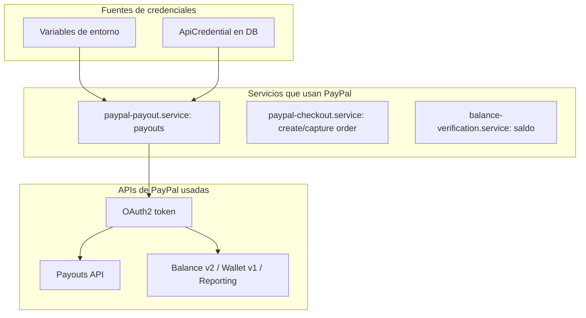

# Guía paso a paso: asegurar que PayPal esté bien configurado

Esta guía describe cómo verificar y configurar correctamente PayPal en Ivan Reseller.

---

## Resumen de la arquitectura PayPal



---

## Paso 1: Credenciales en PayPal Developer Dashboard

1. Ir a [developer.paypal.com](https://developer.paypal.com) e iniciar sesión.
2. **Apps & Credentials** → seleccionar tu app (o crear una).
3. Para **Sandbox** (pruebas): usar las credenciales de la app Sandbox.
4. Para **Producción**: cambiar a modo Live y usar las credenciales Live (Client ID + Secret).
5. **Permisos**: para ver saldo real, las APIs Balance v2, Wallet v1 y Reporting pueden requerir scopes adicionales:
   - `wallet:read` (si no está habilitado por defecto).
   - En algunos casos hay que activar o solicitar acceso a ciertas APIs en el dashboard de la app.
6. Si ves 403 en balance/saldo, revisa en la app que estén habilitados los permisos de lectura de wallet/balance según la documentación de PayPal.

---

## Habilitar saldo real (Balance and Transaction Information)

Para que el saldo "In PayPal" en Finanzas > Working Capital muestre el valor real desde la API (en lugar de "No disponible" o "Declarado"), la app de PayPal debe tener permisos de lectura de balance.

**Pasos concretos:**

1. Ir a [PayPal Developer Dashboard](https://developer.paypal.com/dashboard/applications) e iniciar sesión.
2. En **Apps & Credentials**, cambiar a **Live** (o **Sandbox** si pruebas en entorno de pruebas).
3. Hacer clic en tu app REST para abrirla.
4. En **Features** o **App capabilities**, activar **"Balance and Transaction Information"** o **"Transaction Search"** (como alternativa).
5. Guardar los cambios.
6. **Importante**: la propagación puede tardar hasta 9 horas según la documentación de PayPal. Si tras activar sigues viendo "No disponible", espera unas horas y vuelve a probar.

**Nota**: La Balance Accounts API v2 puede requerir solicitud o contacto con el gestor de cuenta de PayPal en algunos planes. Las APIs Wallet v1 y Reporting (usadas como fallback) suelen estar disponibles tras activar los permisos anteriores.

---

## Paso 2: APIS2.txt con formato correcto

El script `configure-apis-from-apis2.ts` extrae PayPal con estos patrones en `backend/scripts/configure-apis-from-apis2.ts`:

- **Sandbox**: `Sandbox:\nClient ID ...`, `Client ID (AdLn...)`, `Secret (EEKi...)`
- **Live**: `Live:\nClient ID ...`, `client ID (AYH1...)`, `secret Key (EKj...)`

Asegurar que `APIS2.txt` (en la raíz del proyecto) incluya ambas secciones:

```
PayPal
Sandbox:
Client ID ...
Live:
Client ID ...
Secret ...
```

Ver ejemplo en `APIS2.txt` (líneas 72-82).

---

## Paso 3: Configurar variables de entorno

**Local (backend/.env.local)**:

| Variable                          | Descripción                         | Ejemplo                 |
| --------------------------------- | ----------------------------------- | ----------------------- |
| `PAYPAL_CLIENT_ID`                | Client ID (por defecto usa Sandbox) | `AdLn34...` o `AYH1...` |
| `PAYPAL_CLIENT_SECRET`            | Secret correspondiente              | `EEKi...` o `EKj...`    |
| `PAYPAL_ENVIRONMENT`              | `sandbox` o `production`            | `production` para Live  |
| `PAYPAL_SANDBOX_CLIENT_ID`        | Opcional: solo Sandbox              |                         |
| `PAYPAL_SANDBOX_CLIENT_SECRET`    | Opcional: solo Sandbox              |                         |
| `PAYPAL_PRODUCTION_CLIENT_ID`     | Opcional: credenciales Live         |                         |
| `PAYPAL_PRODUCTION_CLIENT_SECRET` | Opcional: credenciales Live         |                         |

**Importante**:

- El script `configure-apis-from-apis2.ts` siempre pone `PAYPAL_ENVIRONMENT = 'sandbox'`.
- Para producción hay que cambiar manualmente a `PAYPAL_ENVIRONMENT = production` y usar credenciales Live en `PAYPAL_PRODUCTION_*` o en `PAYPAL_CLIENT_ID`/`PAYPAL_CLIENT_SECRET`.

**Railway**: definir las mismas variables en Variables del servicio backend (ver [backend/docs/RAILWAY_VARS_FROM_APIS2.md](../backend/docs/RAILWAY_VARS_FROM_APIS2.md)).

---

## Paso 4: Ejecutar script de configuración (opcional)

```bash
cd backend
npx tsx scripts/configure-apis-from-apis2.ts
```

Esto:

- Escribe `backend/.env.local` con las variables extraídas de `APIS2.txt`.
- Inserta credenciales PayPal Live en la base de datos para el usuario con `paypalPayoutEmail`.
- Usa siempre `PAYPAL_ENVIRONMENT = 'sandbox'`; para producción, ajustar manualmente.

---

## Paso 5: Base de datos (credenciales por usuario)

- PayPal puede usarse desde **variables de entorno** o desde **api_credentials**.
- `balance-verification.service` y `paypal-payout.service` buscan primero credenciales del usuario en DB (via `CredentialsManager`), luego hacen fallback a env.
- Para que funcione el saldo/Payout por usuario, el usuario debe tener credenciales PayPal en `api_credentials` o debe existir un usuario con `paypalPayoutEmail` tras ejecutar el script.
- En la UI (APISettings o similar) se pueden configurar credenciales PayPal con scope `user`.

---

## Paso 6: Verificar que esté configurado

**a) Script de estado de env:**

```bash
cd backend
node scripts/check-env-status.mjs
```

Revisar que `PAYPAL_CLIENT_ID`, `PAYPAL_CLIENT_SECRET` y `PAYPAL_ENVIRONMENT` salgan como `OK` o con valores válidos.

**b) Endpoint de diagnósticos:**

```
GET /api/system/diagnostics
```

`diagnostics.paypal` debe ser `OK` cuando `PAYPAL_CLIENT_ID` y `PAYPAL_CLIENT_SECRET` están definidos.

**c) UI de APIs:**
En Configuración de APIs, comprobar que PayPal aparezca como configurado (`checkPayPalAPI` en `backend/src/services/api-availability.service.ts`).

---

## Paso 7: Probar autenticación OAuth

- Si OAuth falla (401): credenciales incorrectas o entorno equivocado.
- Log esperado: `[PAYPAL_ENV_READY]` y autenticación correcta.
- Si aparece 401 en logs de `create-order` o `capture-order`, revisar que `PAYPAL_MODE`/`PAYPAL_ENVIRONMENT` coincida con el tipo de credenciales (sandbox vs production).

---

## Paso 8: Saldo en Finanzas > Working Capital

- El saldo "In PayPal" usa `balance-verification.service.ts` y `paypal-payout.service.ts` (`checkPayPalBalance()`).
- Se intentan en orden: Balance API v2, Wallet API v1, Reporting API.
- Si la API devuelve 403: suele indicar permisos insuficientes en la app de PayPal (p. ej. `wallet:read`).
- **Fallback**: si todas las APIs fallan, se muestra el valor de `workingCapital` (UserWorkflowConfig) con badge "Declarado".

---

## Paso 9: Checklist final

- [ ] Credenciales Sandbox y Live creadas en developer.paypal.com.
- [ ] Permisos/API solicitados si se quiere saldo real (Balance/Wallet).
- [ ] `APIS2.txt` con estructura correcta para Sandbox y Live.
- [ ] `PAYPAL_CLIENT_ID`, `PAYPAL_CLIENT_SECRET`, `PAYPAL_ENVIRONMENT` (o `PAYPAL_PRODUCTION_*`) definidos en .env.local / Railway.
- [ ] `PAYPAL_ENVIRONMENT = production` para pagos reales.
- [ ] `check-env-status.mjs` muestra PayPal OK.
- [ ] `/api/system/diagnostics` devuelve `paypal: OK`.
- [ ] Credenciales PayPal guardadas en DB (si se usa por usuario) o al menos env configurado.
- [ ] Usuario con `paypalPayoutEmail` para payouts.

---

## Documentación relacionada

- [backend/docs/RAILWAY_VARS_FROM_APIS2.md](../backend/docs/RAILWAY_VARS_FROM_APIS2.md): mapeo de variables.
- [docs/AUDITORIA_PAYPAL_API_COMPLETA.md](AUDITORIA_PAYPAL_API_COMPLETA.md): normalización de campos y ambientes.
