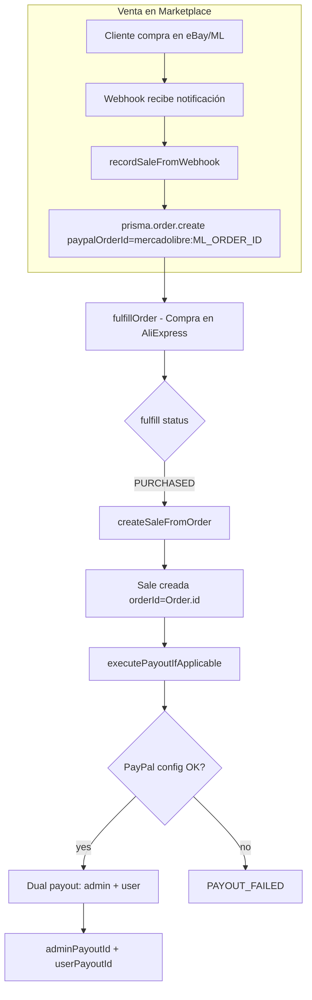

# Plan: Verificación de Ventas Reales y Flujo de Payout

## 1. Objetivos

1. **Verificar** si las ventas en la BD son reales (compras en eBay/MercadoLibre por clientes).
2. **Rastrear** el origen del dinero cuando un cliente compra.
3. **Revisar y corregir** el flujo de payout cuando hay `PAYOUT_FAILED`.

---

## 2. Flujo de Ventas Reales

### Orígenes de Order (y por tanto de Sale)

| Origen | paypalOrderId | Descripción |
|--------|---------------|-------------|
| **Webhook eBay** | `ebay:ITEM_ID` | Venta real en eBay |
| **Webhook MercadoLibre** | `mercadolibre:ML_ORDER_ID` | Venta real en ML |
| **Autopilot sync ML** | `mercadolibre:ML_ORDER_ID` | Sync órdenes ML (autopilot) |
| **PayPal checkout** | ID de PayPal | Compra en nuestro sitio (checkout) |
| **Seed/Test** | N/A, orderId tipo `ORD-2025-001` | Datos de prueba |

### Cómo verificar si una venta es real

- `Sale.orderId` = `Order.id` (CUID)
- `Order.paypalOrderId`:
  - `mercadolibre:12345` → venta real ML
  - `ebay:12345` → venta real eBay
  - ID PayPal (sin prefijo) → checkout
  - null → posible test/seed

---

## 3. ¿Dónde está el dinero?

Cuando un cliente compra en **eBay** o **MercadoLibre**:
- El dinero va a la **cuenta del vendedor** en ese marketplace (eBay/ML).
- Esa cuenta está vinculada a PayPal o a la cuenta bancaria del vendedor en el país del marketplace.
- El **sistema** (esta plataforma) NO recibe el dinero directamente.
- El flujo de **payout** en el código intenta **distribuir la ganancia** desde una cuenta PayPal de la plataforma hacia:
  1. **Admin** (comisión)
  2. **Usuario** (ganancia neta)

Por tanto:
- Si `PAYOUT_FAILED`: la venta es real, el cliente pagó al vendedor en eBay/ML, pero la **plataforma no pudo enviar** la comisión al admin ni la ganancia al usuario vía PayPal Payouts API.
- El dinero de la venta sigue en la cuenta del vendedor en eBay/ML. La plataforma solo intenta hacer **transferencias salientes** (payouts) desde su propia cuenta PayPal.

---

## 4. Causas de PAYOUT_FAILED

Según `sale.service.ts`:

1. **Falta configuración PayPal** (AUTOPILOT_MODE=production):
   - PAYPAL_CLIENT_ID, PAYPAL_CLIENT_SECRET
   - adminPaypalEmail (PlatformConfig)
   - user.paypalPayoutEmail

2. **Saldo insuficiente** en la cuenta PayPal de la plataforma para hacer el payout.

3. **Admin payout falla** (API PayPal devuelve error).

4. **User payout falla** (API PayPal o Payoneer devuelve error).

5. **Usuario sin paypalPayoutEmail** → se marca PAYOUT_FAILED.

---

## 5. Acciones del plan

| # | Acción | Archivo/Área |
|---|--------|--------------|
| 1 | Script de verificación: ventas + Order + paypalOrderId | `scripts/verify-sales-origin.ts` |
| 2 | Consulta manual en BD: últimas ventas con Order | SQL/Prisma |
| 3 | Revisar logs de PAYOUT_FAILED para causas | sale.service.ts, logs |
| 4 | Documentar requisitos para payout exitoso | README o docs |
| 5 | (Opcional) Retry manual de payouts fallidos | Endpoint o script |

---

## 6. Archivos clave

- `backend/src/services/sale.service.ts` - createSale, createSaleFromOrder, executePayout
- `backend/src/api/routes/webhooks.routes.ts` - recordSaleFromWebhook
- `backend/src/services/autopilot.service.ts` - sync ML orders, crea Order con paypalOrderId
- `backend/src/services/order-fulfillment.service.ts` - fulfillOrder → createSaleFromOrder

**Estadísticas de ventas (página Ventas):** Los KPIs (ingresos, beneficio, total ventas) y el gráfico por día consideran ventas con estado **DELIVERED** o **COMPLETED** en la tabla Sale (`getSalesStats` y `/api/dashboard/charts/sales`). Así se alinean con el flujo real (entregado = DELIVERED) y con "Entregado" en inventory-summary.

---

## 7. Resultado verificación (script verify-sales-origin)

Ejecutar: `npm run verify:sales-origin [limit]`

**Hallazgos iniciales:**
- Ventas con orderId tipo CUID pero Order.paypalOrderId = null: origen incierto (posible test/checkout sin ID).
- Ventas con orderId ORD-/TEST-/DEMO-: datos de prueba (seed).
- Para confirmar ventas reales eBay/ML: Order.paypalOrderId debe ser `ebay:...` o `mercadolibre:...`.

**Recomendación:** Revisar flujos que crean Order sin `paypalOrderId` (p.ej. test-full-dropshipping-cycle) y asegurar que webhook/autopilot lo establezcan siempre.
